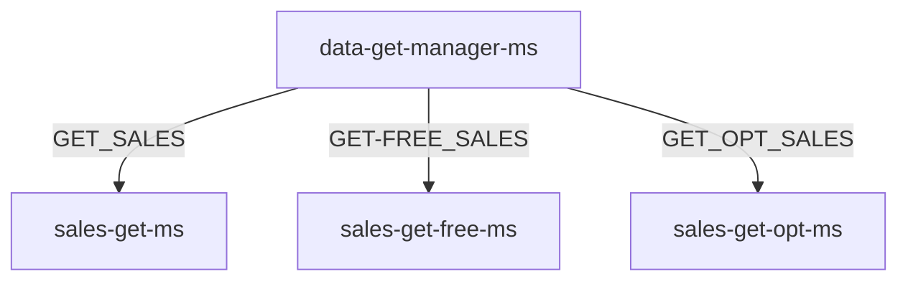

# data-get-manager-ms

#### Description

---

The data-get-manager-ms service works as a router service for get services category and also as a service discovery and load balancer service.

takes the query command and routes the request to the right service based on the query method field.

#### Endpoints

---

##### It exposes only one endpoint at the following URL:

`POST  /selling/data/get/manager/sale/[version]/`

##### The `QueryCommand` request body of the end point has different syntax based on the query method, to see more details, check the documentation of get services.



#### Examples:

1. To call sales-get-ms service:

   ```Json
   {
       "queryFields": [
           {
               "field": "saleDate",
               "value": {
                   "min": "2000-11-12T20:30:15.045+00:00",
                   "max": "2023-11-14T20:30:15.045+00:00"
               },
               "fieldType": "RANGE_DATE"
           }
       ],
       "page": 0,
       "size": 10,
       "commandType": "GET_SALES",
       "sort": {
           "direction": "ASC",
           "field": "customer.satisfaction"
       },
       "exclude": ["items", "customer"],
       "payload": null,
       "expression": null,
       "count": false
   }
   ```

1. To call sales-get-free-ms service:

   ```Json
   {
       "queryFields": {
           "FREE": {
               "field": "FREE",
               "value": "notepad",
               "fieldType": "FREE"
           }
       },
       "page": 0,
       "size": 10,
       "commandType": "GET_FREE_SALES",
       "sort": {
           "direction": "DESC",
           "field": "saleDate"
       },
       "exclude": [],
       "payload": null,
       "expression": null,
       "count": false
   }
   ```

1. To call sales-get-opt-ms service:

   ```Json
   {
       {
       "queryFields": {
           "F1": {
               "field": "purchaseMethod",
               "value": "IN_STORE",
               "fieldType": "STRING"
           },
           "F2": {
               "field": "storeLocation",
               "value": "Seattle",
               "fieldType": "STRING"
           }
       },
       "page": 0,
       "size": 10,
       "commandType": "GET_OPT_SALES",
       "sort": {
           "direction": "DESC",
           "field": "saleDate"
       },
       "exclude": [],
       "payload": null,
       "expression": "( ( NOT ( F1 OR F2 ) ) OR F1 )",
       "count": false
   }
   }
   ```
