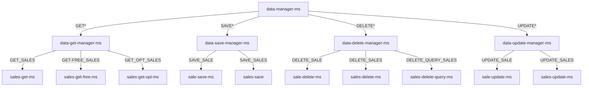

# data-manager-ms

#### Description

---

The data-get-manager-ms service works as a router service for data services category and also as a service discovery and load balancer service.

takes the query command and routes the request to the right service based on the query method field.

#### Endpoints

---

##### It exposes only one endpoint at the following URL:

`POST  /selling/data/manager/sale/[version]/`

##### The `QueryCommand` request body of the end point has different syntax based on the query method, to see more details, check the documentation of data services.



#### Examples:

1. To call data-get-manager-ms service:

   ```Json
   {
       "queryFields": [
           {
               "field": "saleDate",
               "value": {
                   "min": "2000-11-12T20:30:15.045+00:00",
                   "max": "2023-11-14T20:30:15.045+00:00"
               },
               "fieldType": "RANGE_DATE"
           }
       ],
       "page": 0,
       "size": 10,
       "commandType": "GET_SALES",
       "sort": {
           "direction": "ASC",
           "field": "customer.satisfaction"
       },
       "exclude": ["items", "customer"],
       "payload": null,
       "expression": null,
       "count": false
   }
   ```

1. To call data-delete-manager-ms service:

   ```Json
   {
    "queryFields": {
        "F1": {
            "field": "id",
            "value": "654805b71674173d4e14446a",
            "fieldType": "OTHER"
        }
    },
    "page": 0,
    "size": 10,
    "commandType": "DELETE_QUERY_SALES",
    "exclude": [],
    "count": false,
    "payload": null
   }
   ```

1. To call data-save-manager-ms service:

   ```Json
   {
    "queryFields": null,
    "page": 0,
    "size": 10,
    "commandType": "SAVE_SALES",
    "payload": [
        {
        "id": null,
        "saleDate": "2017-11-12T20:30:15.045+00:00",
        "items": [
            {
                "name": "notepad",
                "tags": [
                    "office",
                    "writing",
                    "school"
                ],
                "price": 9.91,
                "quantity": 3
            },
            {
                "name": "pens",
                "tags": [
                    "writing",
                    "office",
                    "school",
                    "stationary"
                ],
                "price": 22.01,
                "quantity": 4
            },
            {
                "name": "backpack",
                "tags": [
                    "school",
                    "travel",
                    "kids"
                ],
                "price": 57.14,
                "quantity": 2
            },
            {
                "name": "binder",
                "tags": [
                    "school",
                    "general",
                    "organization"
                ],
                "price": 21.92,
                "quantity": 7
            },
            {
                "name": "binder",
                "tags": [
                    "school",
                    "general",
                    "organization"
                ],
                "price": 20.12,
                "quantity": 9
            },
            {
                "name": "laptop",
                "tags": [
                    "electronics",
                    "school",
                    "office"
                ],
                "price": 1541.76,
                "quantity": 3
            },
            {
                "name": "printer paper",
                "tags": [
                    "office",
                    "stationary"
                ],
                "price": 45.86,
                "quantity": 6
            }
        ],
        "storeLocation": "London",
        "customer": {
            "gender": "F",
            "age": 50,
            "email": "velo@nukav.fr",
            "satisfaction": 5
        },
        "couponUsed": false,
        "purchaseMethod": "In store"
    },
    {
        "id": null,
        "saleDate": "2017-11-12T20:30:15.045+00:00",
        "items": [
            {
                "name": "notepad",
                "tags": [
                    "office",
                    "writing",
                    "school"
                ],
                "price": 9.91,
                "quantity": 3
            },
            {
                "name": "pens",
                "tags": [
                    "writing",
                    "office",
                    "school",
                    "stationary"
                ],
                "price": 22.01,
                "quantity": 4
            },
            {
                "name": "backpack",
                "tags": [
                    "school",
                    "travel",
                    "kids"
                ],
                "price": 57.14,
                "quantity": 2
            },
            {
                "name": "binder",
                "tags": [
                    "school",
                    "general",
                    "organization"
                ],
                "price": 21.92,
                "quantity": 7
            },
            {
                "name": "binder",
                "tags": [
                    "school",
                    "general",
                    "organization"
                ],
                "price": 20.12,
                "quantity": 9
            },
            {
                "name": "laptop",
                "tags": [
                    "electronics",
                    "school",
                    "office"
                ],
                "price": 1541.76,
                "quantity": 3
            },
            {
                "name": "printer paper",
                "tags": [
                    "office",
                    "stationary"
                ],
                "price": 45.86,
                "quantity": 6
            }
        ],
        "storeLocation": "London",
        "customer": {
            "gender": "F",
            "age": 50,
            "email": "velo@nukav.fr",
            "satisfaction": 5
        },
        "couponUsed": false,
        "purchaseMethod": "In store"
    }
    ]
   }
   ```

1. to call data-update-manager-ms service:
   ```Json
   {
    "queryFields": null,
    "page": 0,
    "size": 10,
    "commandType": "UPDATE_SALE",
    "payload":
        {
        "id": "6555b9108bcd0c2f3635eaa6",
        "saleDate": "2017-11-12T20:30:15.045+00:00",
        "items": [
            {
                "name": "notepad",
                "tags": [
                    "office",
                    "school"
                ],
                "price": 9.91,
                "quantity": 3
            },
            {
                "name": "pens",
                "tags": [
                    "writing",
                    "school",
                    "stationary"
                ],
                "price": 22.01,
                "quantity": 4
            },
            {
                "name": "backpack",
                "tags": [
                    "school",
                    "travel",
                    "kids"
                ],
                "price": 57.14,
                "quantity": 2
            },
            {
                "name": "binder",
                "tags": [
                    "school",
                    "general",
                    "organization"
                ],
                "price": 21.92,
                "quantity": 7
            },
            {
                "name": "binder",
                "tags": [
                    "school",
                    "general",
                    "organization"
                ],
                "price": 20.12,
                "quantity": 9
            },
            {
                "name": "laptop",
                "tags": [
                    "electronics",
                    "school",
                    "office"
                ],
                "price": 1541.76,
                "quantity": 3
            },
            {
                "name": "printer paper",
                "tags": [
                    "office",
                    "stationary"
                ],
                "price": 45.86,
                "quantity": 6
            }
        ],
        "storeLocation": "London",
        "customer": {
            "gender": "F",
            "age": 50,
            "email": "velo@nukav.fr",
            "satisfaction": 5
        },
        "couponUsed": false,
        "purchaseMethod": "In store"
    }
   }
   ```
